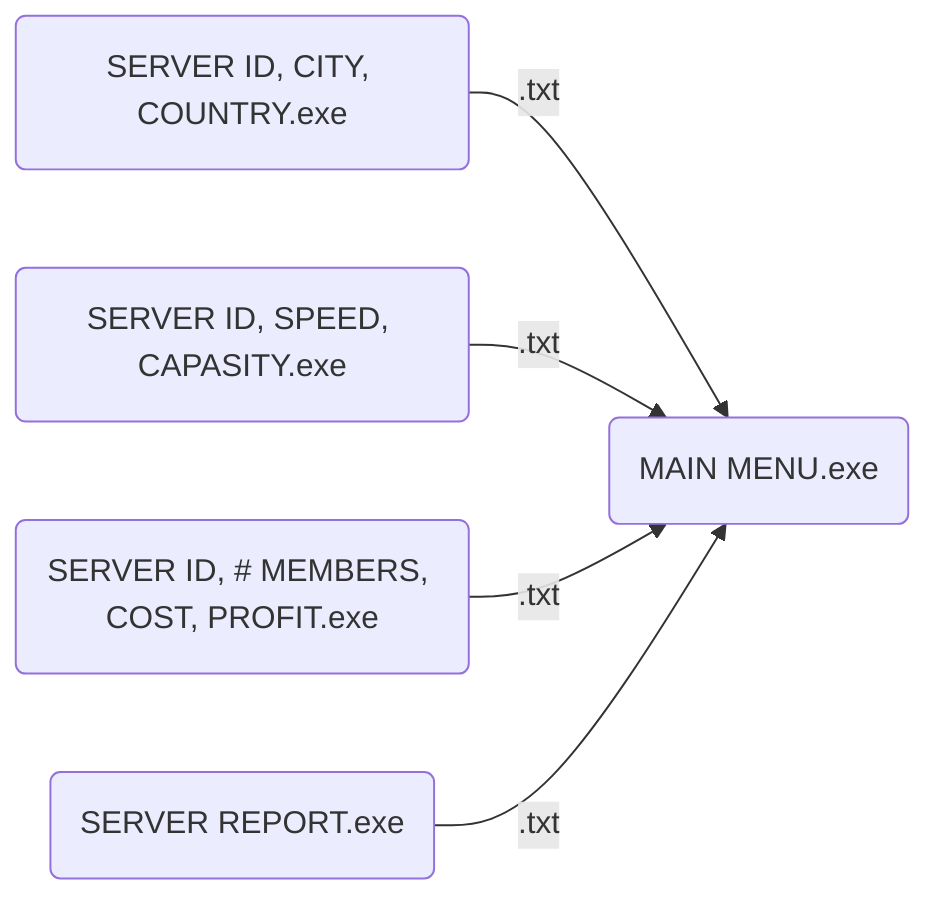

# controlling-textData-C++

Hi! It's a packet cpp program to generating and reading text datas, and also it allows us to combine different text datas into 1 text file.
## Set-up
You can easily start by opening menu.exe or compile all the cpp files and follow the notes.
>1-All .exe files must exist in the same place, and also their name 
must be the same with the .cpp files' name.

>2-There are some sample data files but if you want to delete them,
you can create empty data files by starting the menu.exe.

>3- You can add or delete text datas manually but you have to follow the pattern. To learn how the programs writing data into files you can use .exe files to see once.
## Diagram

